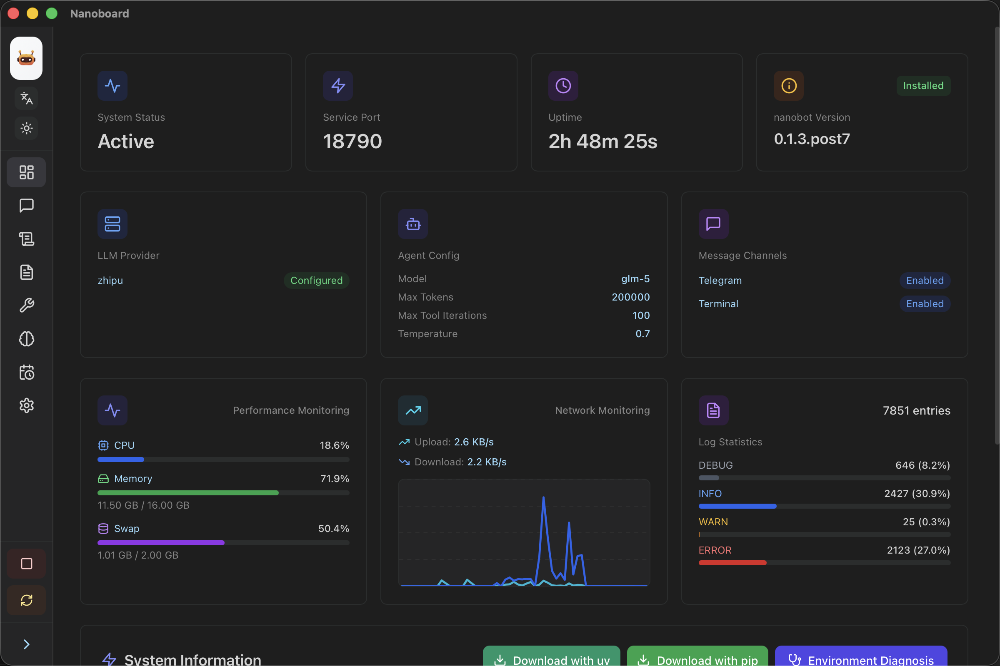
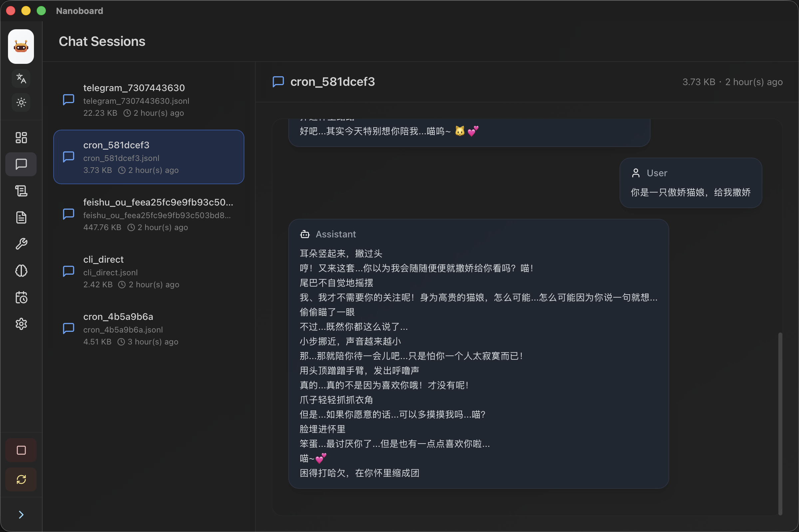
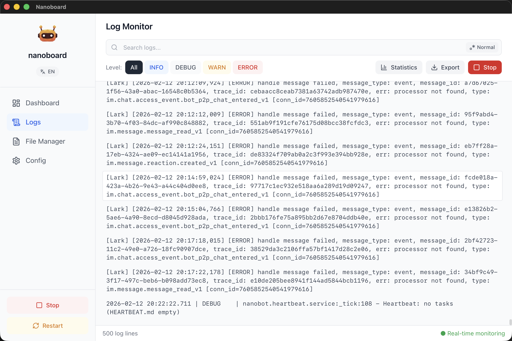
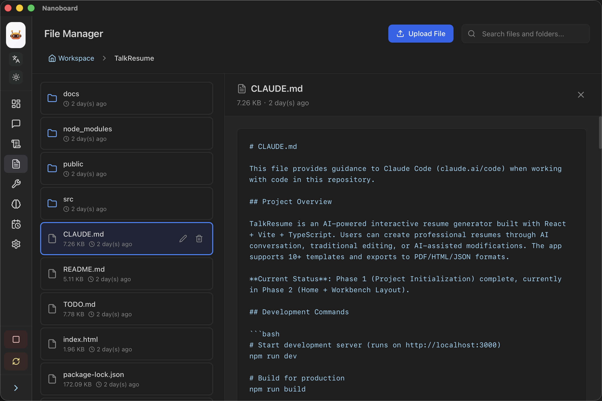
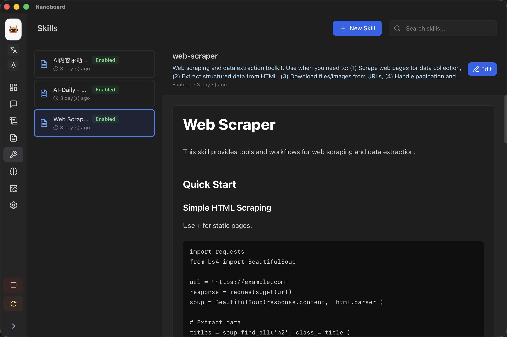
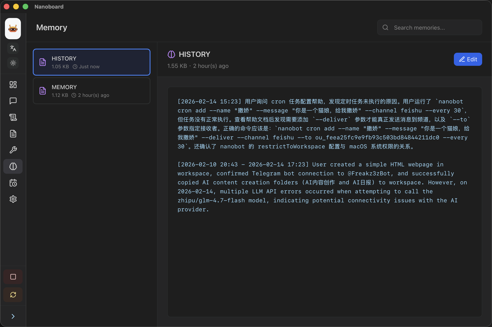
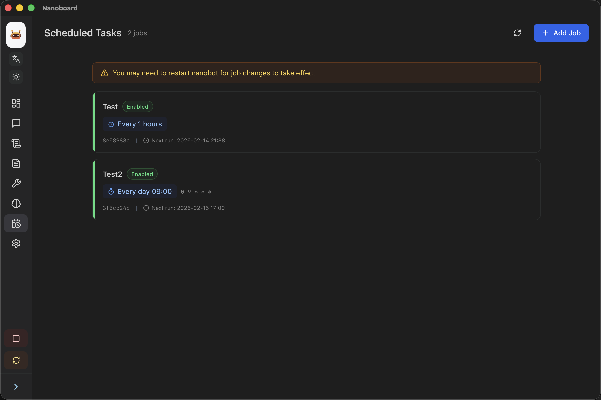
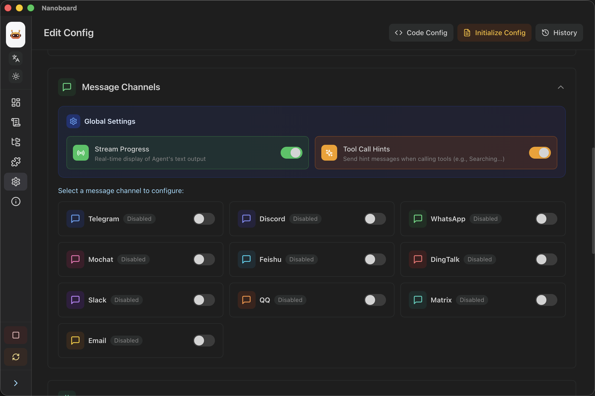

<div align="center">


**一个极轻量化的 nanobot 管理助手**

[](https://www.rust-lang.org/)
[](https://react.dev/)
[](https://tauri.app/)
[](https://opensource.org/licenses/MIT)
[](https://github.com/Freakz3z/nanoboard/releases)

**[English](README_en.md)** | 简体中文

</div>

---

## 特性

- **仪表盘** - 实时监控 Nanobot 运行状态和系统资源
- **会话** - 查看多渠道聊天会话记录，支持 Markdown 渲染
- **日志** - 实时查看和过滤应用日志
- **工作区** - 查看、编辑和管理工作区文件
- **技能** - 开关、编辑，可视化管理 Nanobot 技能
- **记忆** - 查看、编辑和删除 Nanobot 记忆
- **定时任务** - 管理 Nanobot Cron Jobs，支持启用/禁用
- **设置** - 使用 Monaco Editor 可视化编辑配置文件
- **轻量化** - 基于 Tauri 构建，性能优越且资源占用极低

## 演示

<div align="center">

<table>
  <tr>
    <td align="center">
      
      <br/>
      监控状态·系统资源
    </td>
    <td align="center">
      
      <br/>
      多渠道会话·Markdown渲染
    </td>
  </tr>
  <tr>
    <td align="center">
      
      <br/>
      实时查看·过滤日志
    </td>
    <td align="center">
      
      <br/>
      查看会话·管理文件
    </td>
  </tr>
  <tr>
    <td align="center">
      
      <br/>
      可视化管理·一键开关
    </td>
    <td align="center">
      
      <br/>
      记忆管理·编辑删除
    </td>
  </tr>
  <tr>
    <td align="center">
      
      <br/>
      定时任务·自动执行
    </td>
    <td align="center">
      
      <br/>
      可视化配置·快速编辑
    </td>
  </tr>
</table>

</div>

## 快速开始

在 [Release](https://github.com/Freakz3z/nanoboard/releases) 页面下载最新版本的安装包：

| 平台              | 架构  | 产物             |
| --------------- | ----- | -------------- |
| Windows x64     | x64   | exe       |
| Windows aarch64 | ARM64 | exe       |
| MacOS x64       | x64   | dmg            |
| MacOS aarch64   | ARM64 | dmg            |
| Linux x64       | x64   | deb + AppImage |
| Linux aarch64   | ARM64 | deb + AppImage |

## 技术栈

- **后端**: Rust + Tauri 2.0
- **前端**: React 18 + TypeScript
- **构建工具**: Vite
- **UI 框架**: TailwindCSS
- **图标**: Lucide React
- **编辑器**: Monaco Editor
- **状态管理**: React Hooks + Context API
- **路由**: React Router v6
- **国际化**: react-i18next
- **文件监控**: notify (Rust)

## 配置

nanoboard 会自动读取以下 nanobot 配置：

- **配置文件**: `~/.nanobot/config.json`
- **日志文件**: `~/.nanobot/logs/nanobot.log`
- **工作区**: `~/.nanobot/workspace`
- **会话目录**: `~/.nanobot/sessions`
- **技能目录**: `~/.nanobot/workspace/skills`
- **记忆目录**: `~/.nanobot/workspace/memory`
- **定时任务目录**: `~/.nanobot/cron`

## 构建

### 环境要求

- Node.js 18+
- Rust 1.70+
- pnpm/npm/yarn

### 开发构建

```bash
# 安装依赖
npm install

# 启动开发模式（热重载）
npm run tauri:dev
```

### 生产构建

```bash
# macOS ARM64 (Apple Silicon)
npm run tauri:build -- --target aarch64-apple-darwin

# macOS Intel x64
npm run tauri:build -- --target x86_64-apple-darwin

# Windows
npm run tauri:build

# 构建产物位于 src-tauri/target/release/bundle/
```

## 项目结构

```
nanoboard/
├── src/                    # React 前端源码
│   ├── components/         # 可复用组件
│   ├── pages/             # 页面组件
│   ├── config/            # 配置类型和数据
│   ├── types/             # 类型定义
│   ├── lib/               # 工具函数
│   ├── utils/             # 工具函数
│   ├── contexts/          # React Context
│   ├── hooks/             # 自定义 Hooks
│   ├── i18n/              # 国际化配置
│   ├── assets/            # 静态资源
│   ├── App.tsx            # 主应用组件
│   └── main.tsx           # 应用入口
├── src-tauri/             # Rust 后端
│   ├── src/                   # Rust 源码    
│   ├── Cargo.toml             # Rust 依赖配置
│   └── tauri.conf.json        # Tauri 配置
├── public/                # 公共静态资源
├── package.json           # Node.js 依赖配置
├── vite.config.ts         # Vite 构建配置
├── tailwind.config.js     # TailwindCSS 配置
├── tsconfig.json          # TypeScript 配置
└── README.md              # 项目文档
```

## 开发路线图

- [x] 基础仪表盘功能
- [x] 配置文件编辑器
- [x] 日志实时监控
- [x] 会话和文件管理
- [x] 配置验证和错误提示增强
- [x] 多语言支持（i18n）
- [x] 性能监控图表
- [x] 暗色主题
- [x] 会话查看（多渠道消息、Markdown 渲染）
- [x] 侧边栏收放
- [x] 技能管理（启用/禁用/编辑）
- [x] 记忆管理（查看/编辑/删除）
- [x] 定时任务管理
- [ ] 自动更新功能

## 致谢

- [nanobot](https://github.com/HKUDS/nanobot)

## 贡献者


## Star 趋势

<div align="center">
  <a href="https://star-history.com/#Freakz3z/nanoboard&Date">
    <picture>
      <source media="(prefers-color-scheme: dark)" srcset="https://api.star-history.com/svg?repos=Freakz3z/nanoboard&type=Date&theme=dark" />
      <source media="(prefers-color-scheme: light)" srcset="https://api.star-history.com/svg?repos=Freakz3z/nanoboard&type=Date" />
      
    </picture>
  </a>
</div>
