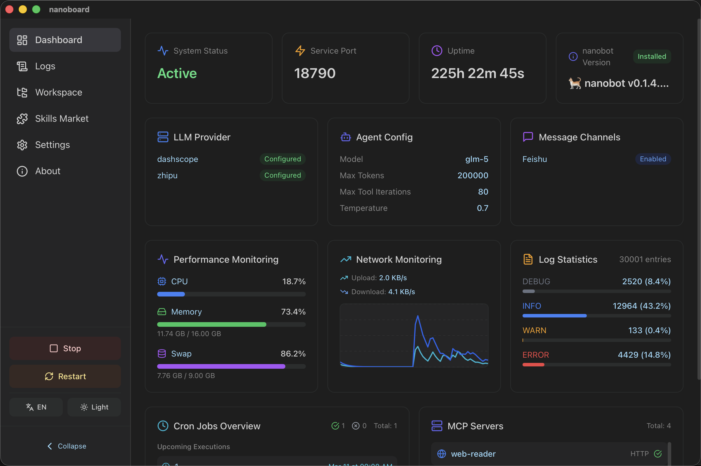

<div align="center">


# Ultra-lightweight nanobot Management Assistant

[](https://www.rust-lang.org/)
[](https://react.dev/)
[](https://tauri.app/)
[](https://opensource.org/licenses/MIT)


English | **[简体中文](README.md)**

</div>

- **Visualization** - Visualize everything about your nanobot! From config files to system resources, from session logs to skills and memory, nanoboard provides an intuitive interface to manage and monitor your nanobot.
- **Convenience** - Say goodbye to complex command-line operations. With nanoboard's user-friendly interface, managing and monitoring your nanobot becomes simple and efficient, allowing you to focus on what matters most!
- **Cross-platform** - Whether you're on Windows, Mac, or Linux, nanoboard has you covered with seamless cross-platform support, ensuring a consistent experience across all your devices!
- **Lightweight** - Built with Rust + Tauri, nanoboard offers excellent performance with minimal resource usage, embodying the nano philosophy in its design!



## Quick Start

Download the latest installation package from the [Release](https://github.com/Freakz3z/nanoboard/releases) page:

| Platform          | Architecture | Artifact        |
| --------------- | ----- | -------------- |
| Windows x64     | x64   | exe       |
| Windows aarch64 | ARM64 | exe       |
| MacOS x64       | x64   | dmg            |
| MacOS aarch64   | ARM64 | dmg            |
| Linux x64       | x64   | deb + AppImage |
| Linux aarch64   | ARM64 | deb + AppImage |

## Configuration

nanoboard automatically reads the following nanobot configurations:

- **Config File**: `~/.nanobot/config.json`
- **Log File**: `~/.nanobot/logs/nanobot.log`
- **Workspace**: `~/.nanobot/workspace`
- **Sessions Directory**: `~/.nanobot/sessions`
- **Skills Directory**: `~/.nanobot/workspace/skills`
- **Memory Directory**: `~/.nanobot/workspace/memory`
- **Cron Directory**: `~/.nanobot/cron`

## Build

### Requirements

- Node.js 18+
- Rust 1.70+
- pnpm/npm/yarn

### Development Build

```bash
# Install dependencies
npm install

# Start development mode (hot reload)
npm run tauri:dev
```

### Production Build

```bash
# macOS ARM64 (Apple Silicon)
npm run tauri:build -- --target aarch64-apple-darwin

# macOS Intel x64
npm run tauri:build -- --target x86_64-apple-darwin

# Windows
npm run tauri:build

# Build artifacts are in src-tauri/target/release/bundle/
```

## Project Structure

```
nanoboard/
├── src/                    # React frontend source
│   ├── components/         # Reusable components
│   ├── pages/             # Page components
│   ├── config/            # Config types and data
│   ├── types/             # Type definitions
│   ├── lib/               # Utility functions
│   ├── utils/             # Utility functions
│   ├── contexts/          # React Context
│   ├── hooks/             # Custom Hooks
│   ├── i18n/              # Internationalization
│   ├── assets/            # Static assets
│   ├── App.tsx            # Main app component
│   └── main.tsx           # App entry
├── src-tauri/             # Rust backend
│   ├── src/                   # Rust source code
│   ├── Cargo.toml             # Rust dependencies
│   └── tauri.conf.json        # Tauri config
├── public/                # Public assets
├── package.json           # Node.js dependencies
├── vite.config.ts         # Vite build config
├── tailwind.config.js     # TailwindCSS config
├── tsconfig.json          # TypeScript config
└── README.md              # Project documentation
```

## Tech Stack

- **Backend**: Rust + Tauri 2.0
- **Frontend**: React 18 + TypeScript
- **Build Tool**: Vite
- **UI Framework**: TailwindCSS
- **Icons**: Lucide React
- **Editor**: Monaco Editor
- **State Management**: React Hooks + Context API
- **Routing**: React Router v6
- **Internationalization**: react-i18next
- **File Monitoring**: notify (Rust)

## Roadmap

- [x] Basic dashboard features
- [x] Config file editor
- [x] Real-time log monitoring
- [x] Session and file management
- [x] Enhanced config validation and error hints
- [x] Multi-language support (i18n)
- [x] Performance monitoring charts
- [x] Dark theme
- [x] Session viewer (multi-channel messages, Markdown rendering)
- [x] Collapsible sidebar
- [x] Skills management (enable/disable/edit)
- [x] Memory management (view/edit/delete)
- [x] Cron jobs management
- [x] ClawHub Skills Market (with installed status indicator, one-click install/uninstall)

## Acknowledgments

[nanobot](https://github.com/HKUDS/nanobot)·[ClawHub](https://clawhub.ai/)

## Contributors


## Star History

<div align="center">
  <a href="https://star-history.com/#Freakz3z/nanoboard&Date">
    <picture>
      <source media="(prefers-color-scheme: dark)" srcset="https://api.star-history.com/svg?repos=Freakz3z/nanoboard&type=Date&theme=dark" />
      <source media="(prefers-color-scheme: light)" srcset="https://api.star-history.com/svg?repos=Freakz3z/nanoboard&type=Date" />
      
    </picture>
  </a>
</div>
